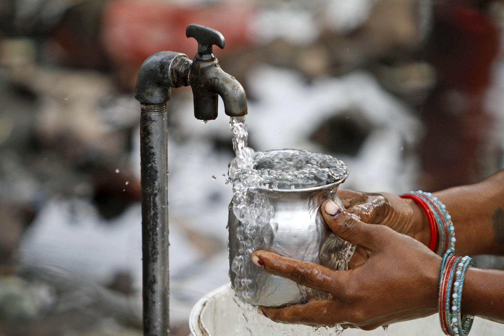
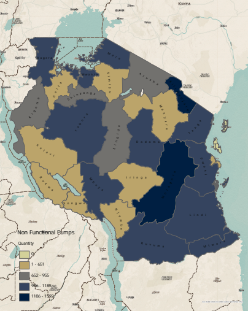

# Tanzania Water Pump Prediction Modeling



# Overview
---
Access to clean water is a fundamental human necessity and not having that access to a clean (or functional) supply of water is a serious health risk. Our initial dataset shows that almost 40% of water pumps throughout regions of Tanzania are not functional, and an additional 7% need repairs.    

In this project, I aim to create a model that will most accurately predict which water pumps are functional, which need repairs, and which need to be replaced completely. To make these predictions, I will start with a baseline machine learning model, then testing and fine-tuning more efficiant models optimizing hyperparameters. 

My analysis began with a simple Logistic Regression Model, then used a Random Forest Model with parameters tuned, and then the final and most efficient analysis was an XGBoost Model. My final model was able to produce a score of __ % taking into consideration the decision to prioritize false negatives. 


# Business Problem
---
Using data gathered from Taarifa and the Tanzanian Ministry of Water, I have been tasked with analyzing the different features corresponding to functional and non functional water pumps with the goal of creating a model that can predict if a pump needs to be replaced. The stakeholder for this project is the World Health Organization and the data was provided by the Taarifa waterpoints dashboard. 

Through my analysis it is important not to just create an accurate prediction model, but to assess our criteria for what an accurate model will look like. Because we are dealing with human health and life, it is important that we use a conservative model. We want to prioritize replacement over not replacement because our business cost is peoples well being. Therefore, for any false predictions our model makes, we want to prioritize False "not functional" (False Negative) over False "functional" (False Positive). This is because the risks are higher for not replacing a pump that needs replacing, over replacing a pump that didn't actually need to be replaced. This is so we can ensure that clean, potable water is available to communities across Tanzania.

This analysis will be used to implement an actionable plan for fixing and replacing water pumps throughout Tanzania.


# Data Understanding
--- 
This projects two datasets came from the Taarifa: an open source platform for the crowd sourced reporting and triaging of infrastructure related issues.

The first dataset contains ID numbers and feature information about each water pump. The second dataset contained ID numbers and pump condition for each water pump. I converted 'Non Functional' into 0, 'Functional Needs Repair' into 1, and 'Functional' into 2 for modeling purposes.

Below is a density map of Non-Functional Pumps by Tanzanian region



# Modeling
---
I tested my data using a baseline Logistic Regression Model and got these results:


I then used SMOTE to deal with data imbalance and used a tuned Random Forest Model with the following tuned hyperparameters:


I then tested out how well an XGBoost Model would perform on the data with the following tuned hypyerparameters:


# Evaluation
---

Looking at the Classification Reports and different Scores for each model, it XGBoost and Random Forest have very similar results - Random Forest Classifier does a better job at predicting 1 (Functional Needs Repair) but overall XGBoost has just slightly better overall scores. Either one would be an acceptable model

I chose Random Forest as the best model. It performed faster than XGBoost which is important for such a large dataset like this, but also it had less False Positive Predictions, which is what I was prioritizing tring to reduce.


# Future Steps
---
**Cost**<br>
Without any cost data we are unable to take into consideration the cost of our analysis when creating a prediction model. Acquiring cost data would allow us to show how much each decision would cost and would provide us with a more accurate cost-benefit analysis. It would be very influential in the decision to choose what type of model we want to prioritize.

But with what we are given without cost data, we are going to prioritize human wellbeing.

**Efficiency/Data Restrictions**<br>
Due to the number of categorical features, after One Hot Encoding, the dataframe was extremely large. I believe that with better resources I would have been able to use more features and produce an even more efficient model.


# Further Questions
---
See the full analysis in the [Jupyter Notebook]() or review this [presentation]()

For any additional questions, please contact Hannah Schurman at [hannah.schurman1@gmail.com](hannah.schurman1@gmail.com) 


# Repository
---
```
├── data
├── images
├── README.md
├── tanzania_water_pump.ipynb
└── tanzania_pump_presentation.pdf
```

